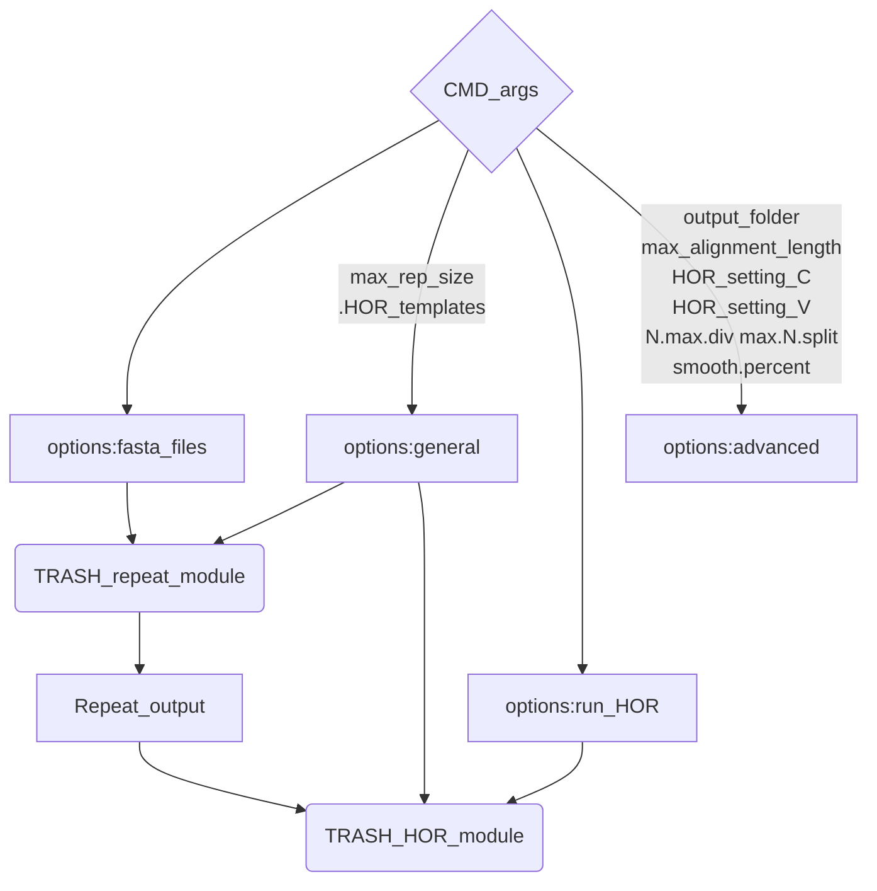

```mermaid
graph TD;
    A{CMD_args};
    A-->options:fasta_files-->B;
    A-->|max_rep_size \n.HOR_templates | options:general-->B;
    A-->options:run_HOR-->C;
    A-->|output_folder \nmax_alignment_length \nHOR_setting_C \nHOR_setting_V \nN.max.div max.N.split \nsmooth.percent| options:advanced;

    B(TRASH_repeat_module);
    B-->Repeat_output;
    C(TRASH_HOR_module);
    options:general-->C;
    Repeat_output-->C;

```
