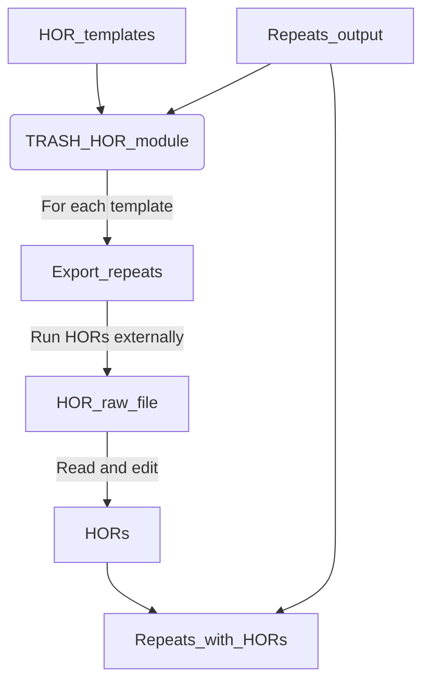

```mermaid
graph TD;
 
    J(TRASH_HOR_module);
    HOR_templates-->J;
    Repeats_output-->J;
    J-->|For each template| Export_repeats;
    Export_repeats-->|Run HORs externally| HOR_raw_file;
    HOR_raw_file-->|Read and edit| HORs;
    HORs-->Repeats_with_HORs;
    Repeats_output-->Repeats_with_HORs;
```
