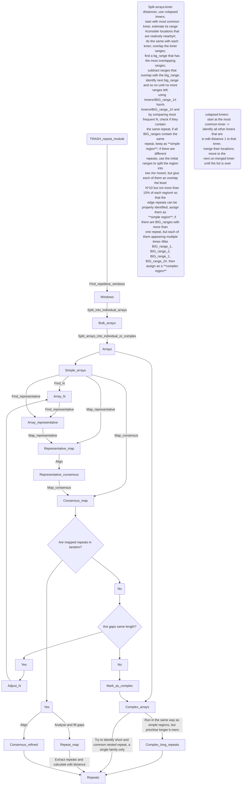

```mermaid
graph TD;
    D(TRASH_repeat_module);
    D-->|Find_repetitive_windows| Windows-->|Split_into_individual_arrays| Bulk_arrays --> |Split_arrays_into_individual_or_complex| E(Arrays);

    E--> Complex_arrays;
    Complex_arrays;
    Complex_arrays-->|Run in the same way as simple regions, but prioritise longer k-mers| Complex_long_repeats;
    Complex_long_repeats--> Repeats;
    Complex_arrays-->|Try to identify short and common nested repeat, a single family only| Repeats;

    E--> Simple_arrays;
    Simple_arrays-->|Find_N| Array_N;
    Array_N-->|Find_representative| Array_representative;
    Simple_arrays-->|Find_representative| Array_representative;
    Simple_arrays-->|Map_representative| Representative_map;
    Array_representative-->|Map_representative| Representative_map;
    Representative_map-->|Align| Representative_consensus;
    Simple_arrays-->|Map_consensus| Consensus_map;
    Representative_consensus-->|Map_consensus| Consensus_map;
    Consensus_map-->F{Are mapped repeats in tandem?};
    F-->G(Yes);
    G-->|Align| Consensus_refined;
    G-->|Analyse and fill gaps| Repeat_map;
    Repeat_map-->|Extract repeats and calculate edit distance| Repeats;

    Consensus_refined-->Repeats;
    F-->H(No);
    H-->I{Are gaps same length?};
    I-->Yes-->Adjust_N-->Array_N;
    I-->No-->Mark_as_complex-->Complex_arrays;

    Y(Split arrays:kmer distances, use colapsed kmers; 
    start with most common kmer, estimate its range 
    #consider locations that are reatively nearby#; 
    do the same with each kmer; overlap the kmer ranges; 
    find a bg_range that has the most overlapping ranges; 
    subtract ranges that overlap with the big_range; 
    identify next big_range and so on until no more ranges left; 
    using kmers#BIG_range_1# %in% kmers#BIG_range_1# and 
    by comparing most frequent N, check if they contain 
    the same repeat; if all BIG_ranges contain the same 
    repeat, keep as **simple region**; if there are different 
    repeats, use the initial ranges to split the region into 
    two #or more#, but give each of them an overlap #at least 
    N*10 but not more than 10% of each region# so that the 
    edge repeats can be properly identified, assign them as 
    **simple region**; if there are BIG_ranges with more than 
    one repeat, but each of them appearing multiple times #like 
    BIG_range_1, BIG_range_2, BIG_range_1, BIG_range_2#, then 
    assign as a **complex region**);

    X(colapsed kmers: 
    start at the most common kmer -> 
    identify all other kmers that are 
    in edit distance 1 to that kmer, 
    merge their locations; move to the 
    next un-merged kmer until the list is over);
```
